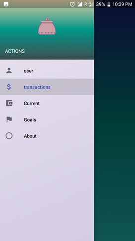

# Wallet
A basic expense tracker android application.
#### Introduction
The app is designed to allow users to keep track of their daily expenses and allowances.
In todays busy world with a plethora of things to do and a countless number of transactions committed by a person in his or her day to day life, it is possible to lose track of their daily expenses.
The app enables user to keep track of their daily expenses to ensure that users don’t find themselves in a financial rut.

